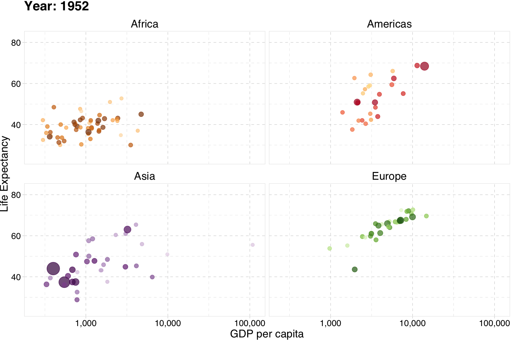

class: inverse, middle

```{r Setup, include = F}
options(htmltools.dir.version = FALSE)
library(pacman)
p_load(leaflet, ggplot2, ggthemes, viridis, dplyr, magrittr, knitr)
# Define pink color
red_pink <- "#e64173"
# Notes directory
dir_slides <- "~/01Intro/"
# Knitr options
opts_chunk$set(
  comment = "#>",
  fig.align = "center",
  fig.height = 7,
  fig.width = 10.5,
  # dpi = 300,
  # cache = T,
  warning = F,
  message = F
)
```

# Prólogo

---
# ¿Por qué?

## Motivación

Comencemos con algunas __preguntas básicas y generales:__

--

1. ¿Cuál es el objetivo de la econometría?

2. ¿Por qué los economistas (u otras personas) estudian o utilizan econometría?

--

__Una respuesta simple:__ aprender sobre el mundo utilizando datos.

--

- _Aprender sobre el mundo_ = plantear, responder y cuestionar teorías, preguntas y supuestos.

- _Datos_ = plural de dato u observación.

---
# ¿Por qué?

## Ejemplo

El promedio académico (GPA) es el resultado de habilidades y horas de estudio.  
Se puede plantear el siguiente modelo:

$\text{GPA}=f(H, \text{SAT}, \text{PCT})$

where $H$ es horas de estudio, $\text{SAT}$ is SAT score and $\text{PCT}$ es el porcentaje de asistencia a clases. Entonces, se puede espera que el GPA aumente con cada una de estas variables ( $H$, $\text{SAT}$, and $\text{PCT}$).

Pero ¿por qué solo _esperar_?

Se puede probar estas hipótesis __usando un modelo de regresión__.

---
layout: true
# ¿Por qué?

## Ejemplo (continuación)

__Modelo de regresión:__

$$ \text{GPA}_i = \beta_0 + \beta_1 H_i + \beta_2 \text{SAT}_i + \beta_3 \text{PCT}_i + \varepsilon_i $$

---

Se tiene que estimar y analizar la relación $\text{GPA}=f(H, \text{SAT}, \text{PCT})$.

---

### Preguntas de repaso

--

- __P:__ ¿Cómo se interpreta $\beta_1$?
--

- __R:__ Una hora adicional de estudio se asocia con un aumento de $\beta_1$ unidades en el GPA, manteniendo constantes SAT y PCT.


--

- __P:__ ¿Los términos $\beta_k$ son parámetros poblacionales o estimadores muestrales?
--

- __R:__ Las letras griegas representan __parámetros poblacionales__. Los estimadores se escriben con sombrero, _e.g._, $\hat{\beta}_k$.  

---

### Preguntas de repaso

- __P:__ ¿Se puede interpretar $\beta_2$ como un efecto causal? 
--

- __R:__ No necesariamente, se necesita conocer supuestos adicionales y comprender el proceso generador de los datos.


--

- __P:__ ¿Qué representa $\varepsilon_i$?
--

- __R:__ La desviación/perturbación aleatoria del individuo respecto a los parametros poblacionales.


---

### Preguntas de repaso

- __P:__ ¿Qué supuestos se imponen al realizar estimaciones con Mínimos Cuadrados Ordinarios (OLS)?
--

- __R:__
  - La relación entre el GPA y las variables explicativas es lineal en los parámetros, y $\varepsilon$ entra de forma aditiva.
  - Las variables explicativas son __exógenas__, _es decir_, $E[\varepsilon|X] = 0$.
  - También se suele asumir algo como: <br> $E[\varepsilon_i] = 0$, $E[\varepsilon_i^2] = \sigma^2$, $E[\varepsilon_i \varepsilon_j] = 0$ para $i \neq j$.
  - Y (tal vez) $\varepsilon_i$ se distribuye de forma normal.


---
layout: false

# Supuestos

## ¿Qué tan importantes pueden ser?

La regresión por **Mínimos Cuadrados Ordinarios (OLS)** es muy **poderosa y flexible**.

No obstante, **sus resultados dependen de los supuestos**.

**Real life often violates these assumptions.**

--

La pregunta clave es: "**¿Qué ocurre cuando se violan los supuestos?**"
- ¿Existe una solución? (Especially: ¿cómo/cuándo es $\beta$ *causal*?)
- ¿Qué ocurre si no aplicamos (o no se puede aplicar) una solución?

OLS sigue haciendo cosas increíbles, pero hay que saber cuándo ser **cauteloso, confiado o escéptico**.

---

# No todo es causal

```{R, spurious, echo = F, dev = "svg"}
tmp <- data.frame(
  year = 1999:2009,
  count = c(
    9, 8, 11, 12, 11, 13, 12, 9, 9, 7, 9,
    6, 5, 5, 10, 8, 14, 10, 4, 8, 5, 6
  ),
  type = rep(c("letters", "deaths"), each = 11)
)
ggplot(data = tmp, aes(x = year, y = count, color = type)) +
  geom_path() +
  geom_point(size = 4) +
  xlab("Año") +
  ylab("Cantidad") +
  scale_color_manual(
    "",
    labels = c("Deaths from spiders", "Letters in the winning spelling bee word"),
    values = c(red_pink, "darkslategray")
  ) +
  theme_pander(base_size = 17) +
  theme(legend.position = "bottom")
```

---

# Econometría

Un econometrista aplicado<sup>†</sup> necesita tener un conocimiento sólido de (al menos) tres áreas:

1. La __teoría__ que sustenta la econometría (supuestos, resultados, fortalezas, debilidades).

1. Cómo __aplicar métodos econométricos__ a datos reales.

1. Métodos eficientes para __trabajar con datos__—cleaning, aggregating, joining, visualizing.  

.footnote[
[†]: _Econometrista aplicado_ .mono[=] Un profesional de la econometría, _e.g._, analyst, consultant, data scientist.
]

--

__Este curso__ tiene como objetivo profundizar tus conocimientos en cada una de estas tres áreas.

--

- 1: As before.
- 2–3: __.mono[R]__

---
class: inverse, middle
# .mono[R]

---
layout: true
# .mono[R]

---

## What is .mono[R]?

To quote the [.mono[R] project website](https://www.r-project.org):

> R is a free software environment for statistical computing and graphics. It compiles and runs on a wide variety of UNIX platforms, Windows and MacOS.

--

¿Qué significa eso?

- .mono[R] fue creado para el trabajo estadístico y gráfico que requiere la econometría.

- .mono[R] cuenta con una comunidad en línea dinámica y próspera. ([stack overflow](https://stackoverflow.com/questions/tagged/r))

- Además, es __free (gratuito)__ y __open source (código abierto)__.

---

## ¿Por qué se utiliza .mono[R]?

1\. .mono[R] is __free__ and __open source__—lo que supone un ahorro tanto para uno como para la universidad 💰💵💰.

2\. _Relacionado:_ Fuera de un pequeño grupo de economistas, los empleadores del sector privado y público __prefieren R__ sobre .mono[Stata] y la mayoría de los programas competidores.

3\. .mono[R] es muy __flexible y potente__—adaptable a casi cualquier tarea, _e.g._, 'métricas, análisis de datos espaciales, aprendizaje automático, extracción de datos web, limpieza de datos, creación de sitios web, enseñanza. Esta presentación se ha creado con .mono[R]. 

---

## ¿Por qué se utiliza .mono[R]?

4\. .mono[R] no impone __ninguna limitación__ en cuanto a la cantidad de observaciones, variables, memoria o potencia de procesamiento.

5\. Si te esfuerzas,<sup>†</sup> terminarás con una herramienta __valiosa y comercializable__.


.footnote[
[†]: Aprender R definitivamente requiere tiempo y esfuerzo.
]
---

```{R, statistical languages, echo = F, fig.height = 6, fig.width = 9, dev = "svg"}
# The popularity data
pop_df <- data.frame(
  lang = c("SQL", "Python", "R", "SAS", "Matlab", "SPSS", "Stata"),
  n_jobs = c(107130, 66976, 48772, 25644, 11464, 3717, 1624),
  free = c(T, T, T, F, F, F, F)
)
pop_df %<>% mutate(lang = lang %>% factor(ordered = T))
# Plot it
ggplot(data = pop_df, aes(x = lang, y = n_jobs, fill = free)) +
geom_col() +
geom_hline(yintercept = 0) +
aes(x = reorder(lang, -n_jobs), fill = reorder(free, -free)) +
xlab("Statistical language") +
scale_y_continuous(label = scales::comma) +
ylab("Number of jobs") +
ggtitle(
  "Comparing statistical languages",
  subtitle = "Number of job postings on Indeed.com, 2019/01/06"
) +
scale_fill_manual(
  "Free?",
  labels = c("True", "False"),
  values = c(red_pink, "darkslategray")
) +
theme_pander(base_size = 17) +
theme(legend.position = "bottom")
```

---

layout: false
class: inverse, middle
# .mono[R] + Ejemplos

---

# .mono[R] + Regression

```{R, example: lm}
# A simple regression
{{fit <- lm(dist ~ 1 + speed, data = cars)}}
# Show the coefficients
coef(summary(fit))
# A nice, clear table
library(broom)
tidy(fit)
```

---

# .mono[R] + Plotting (w/ .mono[plot])

```{R, example: plot, echo = F, dev = "svg"}
# Load packages with dataset
library(gapminder)
# Create dataset
plot(
  x = gapminder$gdpPercap, y = gapminder$lifeExp,
  xlab = "GDP per capita", ylab = "Life Expectancy"
)
```

---

# .mono[R] + Plotting (w/ .mono[plot])

```{R, example: plot code, eval = F}
# Load packages with dataset
library(gapminder)

# Create dataset
plot(
  x = gapminder$gdpPercap, y = gapminder$lifeExp,
  xlab = "GDP per capita", ylab = "Life Expectancy"
)
```

---

# .mono[R] + Plotting (w/ .mono[ggplot2])

```{R, example: ggplot2 v1, echo = F, dev = "svg"}
# Load packages
library(gapminder); library(dplyr)
# Create dataset
ggplot(data = gapminder, aes(x = gdpPercap, y = lifeExp)) +
geom_point(alpha = 0.75) +
scale_x_continuous("GDP per capita", label = scales::comma) +
ylab("Life Expectancy") +
theme_pander(base_size = 16)
```

---

# .mono[R] + Plotting (w/ .mono[ggplot2])

```{R, example: ggplot2 v1 code, eval = F}
# Load packages
library(gapminder); library(dplyr)

# Create dataset
ggplot(data = gapminder, aes(x = gdpPercap, y = lifeExp)) +
geom_point(alpha = 0.75) +
scale_x_continuous("GDP per capita", label = scales::comma) +
ylab("Life Expectancy") +
theme_pander(base_size = 16)
```

---

# .mono[R] + More plotting (w/ .mono[ggplot2])

```{R, example: ggplot2 v2, echo = F, dev = "svg"}
# Load packages
library(gapminder); library(dplyr)
# Create dataset
ggplot(
  data = filter(gapminder, year %in% c(1952, 2002)),
  aes(x = gdpPercap, y = lifeExp, color = continent, group = country)
) +
geom_path(alpha = 0.25) +
geom_point(aes(shape = as.character(year), size = pop), alpha = 0.75) +
scale_x_log10("GDP per capita", label = scales::comma) +
ylab("Life Expectancy") +
scale_shape_manual("Year", values = c(1, 17)) +
scale_color_viridis("Continent", discrete = T, end = 0.95) +
guides(size = F) +
theme_pander(base_size = 16)
```

---

# .mono[R] + More plotting (w/ .mono[ggplot2])

```{R, example: ggplot2 v2 code, eval = F}
# Load packages
library(gapminder); library(dplyr)

# Create dataset
ggplot(
  data = filter(gapminder, year %in% c(1952, 2002)),
  aes(x = gdpPercap, y = lifeExp, color = continent, group = country)
) +
geom_path(alpha = 0.25) +
geom_point(aes(shape = as.character(year), size = pop), alpha = 0.75) +
scale_x_log10("GDP per capita", label = scales::comma) +
ylab("Life Expectancy") +
scale_shape_manual("Year", values = c(1, 17)) +
scale_color_viridis("Continent", discrete = T, end = 0.95) +
guides(size = F) +
theme_pander(base_size = 16)
```

---

# .mono[R] + Animated plots (w/ .mono[gganimate])

```{R, example: gganimate, include = F, cache = T, eval = F}
# The package for animating ggplot2
library(gganimate)
# As before
gg <- ggplot(
  data = gapminder %>% filter(continent != "Oceania"),
  aes(gdpPercap, lifeExp, size = pop, color = country)
) +
geom_point(alpha = 0.7, show.legend = FALSE) +
scale_colour_manual(values = country_colors) +
scale_size(range = c(2, 12)) +
scale_x_log10("GDP per capita", label = scales::comma) +
facet_wrap(~continent) +
theme_pander(base_size = 16) +
theme(panel.border = element_rect(color = "grey90", fill = NA)) +
# Here comes the gganimate-specific bits
labs(title = "Year: {frame_time}") +
ylab("Life Expectancy") +
transition_time(year) +
ease_aes("linear")
# Save the animation
anim_save(
  animation = gg,
  filename = "ex_gganimate.gif",
  path = dir_slides,
  width = 10.5,
  height = 7,
  units = "in",
  res = 150,
  nframes = 56
)
```

.center[]
---

# .mono[R] + Animated plots (w/ .mono[gganimate])

```{R, example: gganimate code, eval = F}
# The package for animating ggplot2
library(gganimate)
# As before
ggplot(
  data = gapminder %>% filter(continent != "Oceania"),
  aes(gdpPercap, lifeExp, size = pop, color = country)
) +
geom_point(alpha = 0.7, show.legend = FALSE) +
scale_colour_manual(values = country_colors) +
scale_size(range = c(2, 12)) +
scale_x_log10("GDP per capita", label = scales::comma) +
facet_wrap(~continent) +
theme_pander(base_size = 16) +
theme(panel.border = element_rect(color = "grey90", fill = NA)) +
# Here comes the gganimate-specific bits
labs(title = "Year: {frame_time}") +
ylab("Life Expectancy") +
transition_time(year) +
ease_aes("linear")
```

---

# .mono[R] + Maps

```{R, example: leaflet, fig.height = 6, dev = "svg"}
library(leaflet)
leaflet() %>%
  addTiles() %>%
  setView(lat =-17.7708013717708 ,lng =-63.19566931987824 ,zoom = 14.5) %>% 
  addMarkers(lng = -17.7708013717708, lat = -63.19566931987824, popup = "UAGRM")
```

---
class: inverse, middle
# Empezando con .mono[R]

---
layout: true
# Introducción a .mono[R]

---

## Installation

- Install [.mono[R]](https://www.r-project.org/).

- Install [.mono[RStudio]](https://www.rstudio.com/products/rstudio/download/preview/).

- Install [.mono[Posit cloud]](https://posit.cloud/).


---

## Recursos

### Gratis (o casi)

- Google (que inevitablemente lleva a StackOverflow)
- Tiempo
- Sus compañeros de clase
- Book:[_R para principiantes_](https://bookdown.org/jboscomendoza/r-principiantes4/)
- Book:[R Cookbook](https://rc2e.com/)
- Book:[R Graphics Cookbook](https://r-graphics.org/)
- Recursos de .mono[R] [here](https://www.rstudio.com/online-learning/)

### Con costo

- Book: [_R for Stata Users_](http://r4stats.com/books/r4stata/)
- Short online course: [DataCamp](https://www.datacamp.com)


---

## Algunos conceptos básicos de .mono[R]

Se profundizará más en .mono[R] en las clases, pero aquí tienes seis puntos importantes sobre .mono[R]:

.more-left[

1. Everything is an __object__.

1. Every object has a __name__ and __value__.

1. You use __functions__ on these objects.

1. Functions come in __libraries__ (__packages__)

1. .mono[R] will try to __help__ you.

1. .mono[R] tiene sus __peculiaridades__.

]

.less-right[

`foo`

`foo <- 2`

`mean(foo)`

`library(dplyr)`

`?dplyr`

`NA; error; warning`

]


---
layout: false
class: inverse, middle

# Siguiente: Ordinary Least Squares

---
exclude: true

```{R, print pdfs, echo = F, eval = T}
pagedown::chrome_print(input = "01-intro.html")
```
